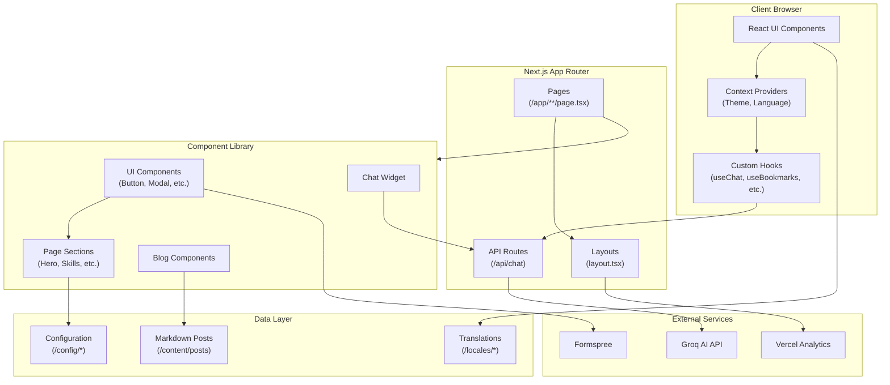
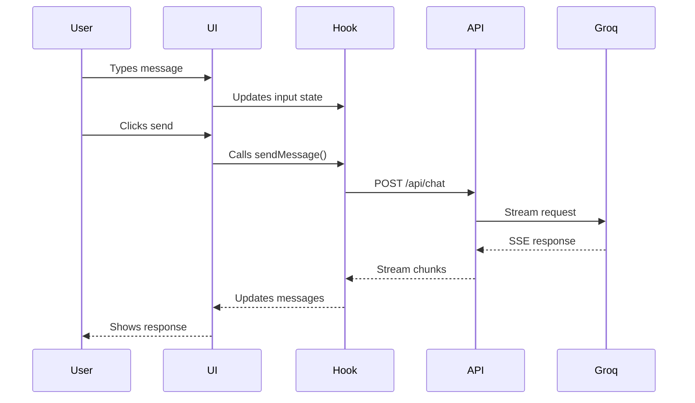

# Architecture Diagram



## Layer Descriptions

### Client Layer
- **React UI Components**: All visible user interface elements
- **Context Providers**: Global state management (Theme, Language)
- **Custom Hooks**: Reusable logic (useChat, useBookmarks, useFocusManagement)

### Next.js App Router
- **Pages**: File-based routing under `/app`
- **Layouts**: Shared layout components
- **API Routes**: Server-side API endpoints

### Component Library
- **UI Components**: Reusable components (Button, Modal, Tooltip, etc.)
- **Page Sections**: Composed sections (Hero, Skills, Experience)
- **Chat Widget**: AI-powered chatbot interface
- **Blog Components**: Blog-specific components (TableOfContents, RelatedPosts)

### External Services
- **Groq AI API**: Powers the chatbot responses
- **Formspree**: Handles contact form submissions
- **Vercel Analytics**: Tracks page views and performance

### Data Layer
- **Markdown Posts**: Blog content in `/content/posts`
- **Configuration**: Site and resume config in `/config`
- **Translations**: Multi-language support in `/locales`

## Data Flow



## Directory Structure

```
src/
├── app/                 # Next.js App Router pages
│   ├── api/chat/        # Chat API endpoint
│   ├── blog/            # Blog pages
│   └── portfolio/       # Portfolio page
├── components/
│   ├── chat/            # Chat widget
│   ├── layout/          # Layout components
│   ├── sections/        # Page sections
│   ├── seo/             # SEO components
│   └── ui/              # UI component library
├── config/              # Configuration files
├── content/posts/       # Markdown blog posts
├── context/             # React context providers
├── hooks/               # Custom React hooks
├── lib/                 # Utility functions
├── locales/             # Translation files
└── types/               # TypeScript types
```
