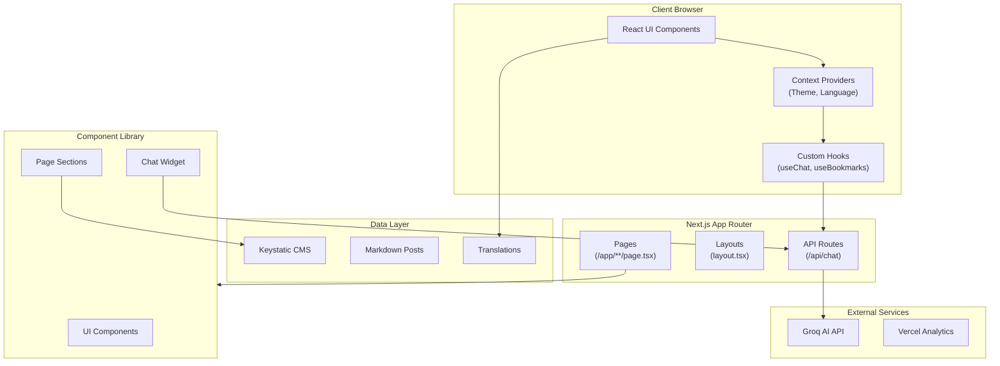
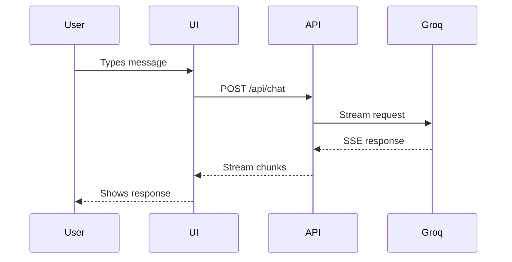

# Architecture

[← Back to Home](Home)

This document provides a high-level overview of the portfolio website architecture.

## System Overview



## Tech Stack

| Layer | Technology | Purpose |
|-------|------------|---------|
| **Framework** | Next.js 16 | App Router, SSR, API Routes |
| **Styling** | Tailwind CSS v4 | Utility-first CSS |
| **Animation** | Framer Motion | Scroll animations, transitions |
| **CMS** | Keystatic | Content management |
| **AI** | Groq (Llama 3.1) | Chatbot responses |
| **Testing** | Jest, Playwright | Unit & E2E tests |
| **Deployment** | Vercel | Hosting, Edge Functions |

## Key Design Decisions

### 1. Next.js App Router
Server Components for static content, Client Components for interactivity.
See [ADR-001](../adr/001-nextjs-app-router.md)

### 2. Keystatic CMS
File-based CMS for managing projects, experience, and skills.
See [ADR-0004](../adr/0004-use-keystatic-cms.md)

### 3. Context-Based State
React Context for Theme and Language without external libraries.

### 4. Localization Strategy
TypeScript locale files with type-safe translations.
See [ADR-005](../adr/005-internationalization.md)

## Directory Structure

```
src/
├── app/                 # Next.js pages & API routes
│   ├── api/chat/        # AI chatbot endpoint
│   ├── blog/            # Blog pages
│   ├── portfolio/       # Portfolio pages
│   └── keystatic/       # CMS admin
├── components/
│   ├── chat/            # Chat widget
│   ├── layout/          # Header, Footer
│   ├── sections/        # Page sections
│   └── ui/              # Reusable components
├── config/              # Site configuration
├── content/             # Keystatic content (JSON)
├── context/             # React providers
├── hooks/               # Custom hooks
├── lib/                 # Utilities
└── locales/             # i18n translations
```

## Data Flow



## Related Documentation

- [ADR Index](ADR-Index) - All architecture decisions
- [Components](Components) - Component library
- [API Reference](API-Reference) - API endpoints
